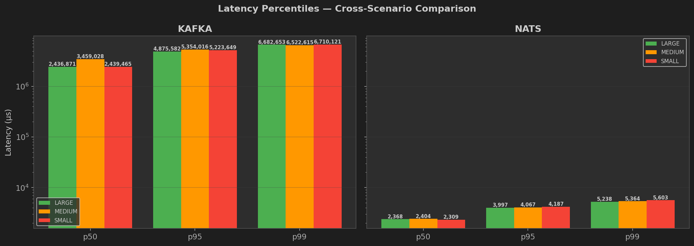

<p align="center">
  <picture>
    <source media="(prefers-color-scheme: dark)" srcset="assets/knack-logo-dark.png" />
    <source media="(prefers-color-scheme: light)" srcset="assets/knack-logo.png" />
    
  </picture>
</p>

<h3 align="center">Kafka + NATS Benchmark Suite for Restricted-Hardware Environments</h3>

<p align="center">
  <a href="LICENSE"></a>
  
  
</p>

---

**Knack** (**K**afka + **NA**ts **C**hec**K**) is a production-grade benchmark suite that pits Apache Kafka against NATS JetStream across 9 categories on hardware-constrained environments. It generates detailed JSON reports, 20+ charts, cross-scenario comparisons, and an automated recommendation.

<p align="center">
  <a href="sample-report/benchmark_report.md"><strong>View Full Sample Report</strong></a>
</p>

## Sample Output

<p align="center">
  
</p>

<details>
<summary><strong>More charts (click to expand)</strong></summary>
<br>

| Scorecard | Throughput |
|:---:|:---:|
|  |  |

| Resource Timeline | Cross-Scenario Latency |
|:---:|:---:|
|  |  |

| Memory Stress | Resource Scaling |
|:---:|:---:|
|  |  |

| Cross-Scenario Comparison |
|:---:|
|  |

</details>

## Quick Install

```bash
curl -fsSL https://raw.githubusercontent.com/jainal09/knack/main/install.sh | bash
```

Or manually:

```bash
git clone https://github.com/jainal09/knack.git
cd knack
uv sync
```

## Quick Start

```bash
knack infra up            # Start Kafka + NATS containers
knack run --quick         # Quick smoke test (~45 min)
knack status --watch      # Monitor progress live
knack report              # Generate Markdown reports + charts
knack infra down          # Tear down
```

## What It Benchmarks

| # | Benchmark | What it measures |
|---|-----------|------------------|
| 1 | **Idle Footprint** | RAM + CPU at rest |
| 2 | **Startup & Recovery** | Cold start and SIGKILL recovery time |
| 3 | **Throughput** | Max producer throughput (Python client + CLI) |
| 4 | **Latency** | End-to-end p50/p95/p99/p99.9 at 50% peak rate |
| 5 | **Memory Stress** | Stability at 4g, 2g, 1g, 512m RAM |
| 6 | **CLI Throughput** | Native CLI throughput (kcat / nats bench) |
| 7 | **Consumer** | Consumer-only throughput |
| 8 | **Producer + Consumer** | Simultaneous producer + consumer load |
| 9 | **Resource Scaling** | Throughput under varying CPU limits (6 levels) |

Each benchmark runs across multiple hardware profiles (large / medium / small), so you see how each broker degrades as resources shrink.

## CLI Reference

```
knack <command> [options]
```

| Command | Description |
|---------|-------------|
| `knack run` | Run the full benchmark suite |
| `knack run --quick` | Quick smoke test (~45 min across all scenarios) |
| `knack run --scenario large` | Run a single scenario |
| `knack run --list` | List available scenarios |
| `knack status` | Show benchmark status |
| `knack status --watch` | Live watch mode (auto-refresh, auto-exit) |
| `knack report` | Generate Markdown reports for all completed scenarios |
| `knack report --scenario large` | Report for a specific scenario |
| `knack infra up` | Start Kafka + NATS broker containers |
| `knack infra up --ui` | Start with UI tools (Redpanda Console, Nui) |
| `knack infra down` | Stop and remove containers + volumes |
| `knack version` | Print version |
| `knack help` | Show help |

### Run Flags

| Flag | Description | Default |
|------|-------------|---------|
| `--quick` | Quick smoke run (30s duration, 1 rep, 2 producers) | -- |
| `--duration SEC` | Throughput test duration per run | 600 |
| `--reps N` | Number of throughput repetitions (median used) | 3 |
| `--idle-wait SEC` | Idle wait time for footprint measurement | 300 |
| `--producers N` | Number of parallel producers | 4 |
| `--memory SIZE` | Broker memory limit (e.g., `2g`, `512m`) | 4g |
| `--ui` | Start UI containers alongside brokers | off |
| `--results-dir DIR` | Output directory for results | `results/` |
| `--resume` | Resume from last checkpoint (skip completed steps) | -- |
| `--rerun STEPS` | Re-run specific steps (comma-separated), implies `--resume` | -- |
| `--scenario NAME` | Run a single scenario (large, medium, small) | all |

## Configuration

All parameters live in `env.sh` and can be overridden with environment variables:

| Variable | Default | Description |
|----------|---------|-------------|
| `BENCH_CPUS` | `2.0` | CPU cores per broker container |
| `BENCH_MEMORY` | `4g` | Starting RAM cap |
| `BENCH_DISK_TYPE` | `ssd` | Host disk type (metadata) |
| `PAYLOAD_BYTES` | `1024` | Message payload size (bytes) |
| `NUM_PRODUCERS` | `4` | Parallel producer threads |
| `NUM_CONSUMERS` | `4` | Parallel consumer threads |
| `TEST_DURATION_SEC` | `600` | Throughput test duration (seconds) |
| `REPS` | `3` | Throughput repetitions |
| `SCALING_CPU_LEVELS` | `4.0 3.0 2.0 1.5 1.0 0.5` | CPU levels for scaling test |

Scenario hardware profiles:

| Scenario | CPUs | Memory |
|----------|------|--------|
| large | 4.0 | 8g |
| medium | 3.0 | 4g |
| small | 2.0 | 2g |

## Report Output

After benchmarks complete, `knack report` generates:

- **Per-scenario reports** at `results/{scenario}/benchmark_report.md` with every chart embedded and data tables
- **Consolidated report** at `results/benchmark_report.md` combining all scenarios with a table of contents
- **JSON data** at `results/{scenario}/full_report.json` with raw metrics and automated recommendation
- **Decision** — one of: `KEEP_KAFKA`, `MIGRATE_TO_NATS`, `TRADEOFF`, or `INCONCLUSIVE`

### Charts Generated

#### Per-Scenario (20 charts per scenario)

| # | Chart | Description |
|---|-------|-------------|
| 01 | `01_idle_footprint.png` | Idle RAM + CPU (2-bar subplot) |
| 02 | `02_startup_recovery.png` | Cold start / SIGKILL recovery time |
| 03 | `03_throughput.png` | Python client vs CLI producer throughput |
| 03b | `03b_cli_throughput.png` | CLI-only: producer / consumer / prodcon throughput |
| 04 | `04_latency.png` | p50 / p95 / p99 / p99.9 / max latency (log scale) |
| 05 | `05_memory_stress.png` | Pass/fail heatmap per memory level |
| 06 | `06_scorecard.png` | Full metric comparison table with winner per row |
| 07 | `07_consumer_throughput.png` | Python vs CLI consumer throughput |
| 08 | `08_prodcon.png` | Producer + consumer rates under simultaneous load |
| 09 | `09_resource_timeline.png` | CPU% + memory over time |
| 10 | `10_resource_scaling.png` | Throughput + peak memory vs CPU limit |
| 11 | `11_disk_io_timeline.png` | Disk read/write over time |
| 12 | `12_throughput_vs_resources.png` | Resource efficiency: throughput per CPU core and per GB RAM |
| 13 | `13_worker_balance.png` | Per-worker throughput distribution |
| 14 | `14_error_breakdown.png` | Error counts across all test types |
| 15 | `15_throughput_stability.png` | Mean +/- stddev across repetitions with CV% |
| 16 | `16_prodcon_balance.png` | Producer / consumer rate ratio |
| 17 | `17_network_io_timeline.png` | Network RX/TX over time |
| 18 | `18_memory_headroom.png` | Memory usage % with 80%/95% danger thresholds |
| 19 | `19_scaling_efficiency.png` | Throughput-per-CPU-core at each limit |
| 20 | `20_latency_context.png` | Latency test context: load%, target rate, samples |

#### Cross-Scenario Comparison (11 charts)

| # | Chart | Description |
|---|-------|-------------|
| 01 | `cmp_01_idle.png` | Idle RAM across scenarios |
| 02 | `cmp_02_startup.png` | Startup / recovery across scenarios |
| 03 | `cmp_03_throughput.png` | Python client throughput across scenarios |
| 04 | `cmp_04_cli_throughput.png` | CLI throughput across scenarios |
| 05 | `cmp_05_latency.png` | Latency percentiles per broker per scenario |
| 06 | `cmp_06_memory_stress.png` | Pass/fail heatmap across scenarios |
| 07 | `cmp_07_consumer.png` | Consumer throughput across scenarios |
| 08 | `cmp_08_prodcon.png` | ProdCon rates across scenarios |
| 09 | `cmp_09_resource_scaling.png` | Throughput-vs-CPU scaling slopes |
| 10 | `cmp_10_resource_timeline.png` | CPU / RAM / disk I/O over time per scenario |
| 11 | `cmp_11_throughput_vs_resources.png` | Resource efficiency across scenarios |
| -- | `mega_comparison.png` | All comparison charts + scorecards tiled into one image |

## Architecture

```
knack                          # CLI entry point (dispatches to scripts below)
run_scenarios.sh               # Multi-scenario orchestrator
run_all.sh                     # Single-scenario benchmark engine
scripts/
  bench_idle.sh                # Idle footprint
  bench_startup.sh             # Startup & recovery
  bench_throughput.sh          # Max throughput (producer)
  bench_latency.sh             # Latency under load
  bench_memory_stress.sh       # Memory stress
  bench_cli_throughput.sh      # CLI-native throughput
  bench_consumer.sh            # Consumer-only throughput
  bench_prodcon.sh             # Simultaneous producer + consumer
  bench_resource_scaling.sh    # Throughput vs CPU limit
bench/
  producer_kafka.py            # Kafka Python producer
  producer_nats.py             # NATS Python producer
  consumer_kafka.py            # Kafka Python consumer
  consumer_nats.py             # NATS Python consumer
  prodcon_kafka.py             # Kafka simultaneous prod+con
  prodcon_nats.py              # NATS simultaneous prod+con
  aggregate_results.py         # Merge results + recommendation
  visualize.py                 # Chart generation (matplotlib)
infra/
  docker-compose.kafka.yml     # Kafka broker + optional UI
  docker-compose.nats.yml      # NATS broker + optional UI
```

## Advanced Usage

### Run individual benchmark scripts

```bash
bash scripts/bench_idle.sh
bash scripts/bench_throughput.sh
bash scripts/bench_latency.sh
```

### Single-config custom run

```bash
BENCH_CPUS=2.0 BENCH_MEMORY=4g ./run_all.sh
./run_all.sh --duration 120
./run_all.sh --resume
./run_all.sh --rerun latency,consumer
```

### Re-run missing steps

```bash
knack run --scenario medium --rerun cli_throughput,consumer,prodcon
```

### Generate charts directly

```bash
uv run python3 bench/visualize.py              # single-scenario charts
uv run python3 bench/visualize.py --compare    # cross-scenario comparison
```

### Generate aggregate report

```bash
uv run python3 bench/aggregate_results.py
```

## Where Results Live

```
results/
  large/ medium/ small/          # per-scenario directories
    *.json                       # raw benchmark data
    docker_stats.csv             # container metrics
    full_report.json             # aggregated report + decision
    benchmark_report.md          # per-scenario Markdown report
    charts/                      # per-scenario chart PNGs
  benchmark_report.md            # consolidated report (all scenarios)
  comparison/                    # cross-scenario charts
    cmp_*.png
    mega_comparison.png
```

## Dependencies & Acknowledgements

Knack relies on several excellent open-source tools:

- **[Apache Kafka](https://kafka.apache.org/)** — distributed event streaming platform
- **[NATS JetStream](https://nats.io/)** — cloud-native messaging system with persistence
- **[kcat](https://github.com/edenhill/kcat)** (formerly kafkacat) — CLI producer/consumer for Kafka, used for CLI throughput benchmarks
- **[nats CLI](https://github.com/nats-io/natscli)** — official NATS command-line tool, used for CLI benchmarks (`nats bench`)
- **[Redpanda Console](https://github.com/redpanda-data/console)** — Kafka UI for monitoring (optional)
- **[Nui](https://github.com/nats-nui/nui)** — NATS UI for monitoring (optional)
- **[aiokafka](https://github.com/aio-libs/aiokafka)** — async Python Kafka client
- **[nats.py](https://github.com/nats-io/nats.py)** — official async Python NATS client
- **[matplotlib](https://matplotlib.org/)** — chart and visualization generation
- **[uv](https://github.com/astral-sh/uv)** — fast Python package manager
- **[Docker](https://www.docker.com/)** — container runtime for broker infrastructure

## Contributing

See [CONTRIBUTING.md](CONTRIBUTING.md) for guidelines.

## License

[MIT](LICENSE)
