# Knack — Consolidated Benchmark Report

This report combines results from all scenario sizes into a single document.

## Table of Contents

- [Scenario: SMALL](#scenario-small)
- [Scenario: MEDIUM](#scenario-medium)
- [Scenario: LARGE](#scenario-large)

---

# Knack Benchmark Report: SMALL

| Field | Value |
|-------|-------|
| **Scenario** | small |
| **Run timestamp** | 2026-04-08 17:14:24 |
| **CPUs** | 2.0 |
| **Memory** | 4g |
| **Payload** | 1024 bytes |
| **Producers** | 4 |
| **Consumers** | 4 |

---

## 1. Idle Footprint

> **What this measures:** CPU and memory consumed by each broker when idle (no producers/consumers active). Lower is better — a lighter idle footprint means less wasted resources when your system is between load spikes.

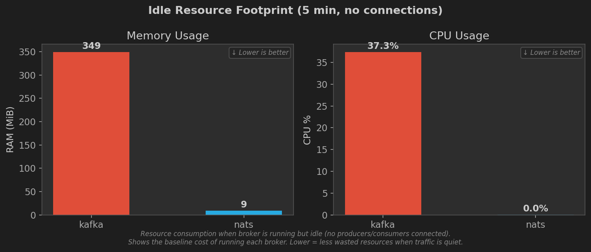

| Metric | Kafka | NATS |
|--------|-------|------|
| CPU | 37.34% | 0.04% |
| Memory | 348.6MiB / 2GiB | 8.977MiB / 2GiB |
| Memory % | 17.02% | 0.44% |

---

## 2. Startup & Recovery

> **What this measures:** Time for the broker to become ready from a cold start, and time to recover after a SIGKILL (simulating a crash). Lower is better — faster recovery means shorter outage windows.

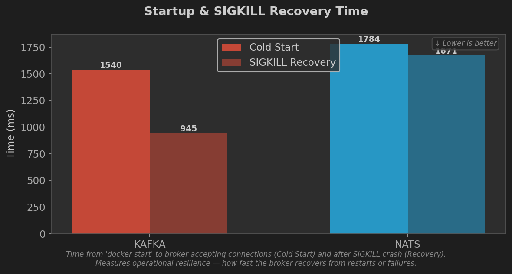

| Metric | Kafka | NATS |
|--------|-------|------|
| Cold start | 1,540 ms | 1,784 ms |
| SIGKILL recovery | 945 ms | 1,671 ms |

---

## 3. Producer Throughput (Python Client)

> **What this measures:** Maximum producer message rate using the Python client library (confluent-kafka for Kafka, nats-py for NATS). Runs multiple producer threads at full speed for a fixed duration. Higher is better, but note this reflects **client library performance** — Python GIL and async overhead affect results. See §3b for raw broker capacity.

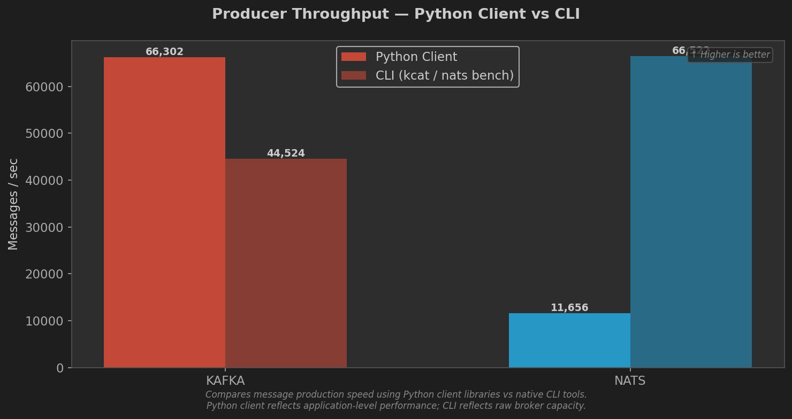

| Run | Kafka (msg/s) | NATS (msg/s) |
|-----|---------------|--------------|
| 1 | 75,896.2 | 10,579.4 |
| 2 | 65,017.5 | 11,705.1 |
| 3 | 66,301.6 | 11,656.2 |
| **Median** | **66,301.6** | **11,656.2** |

---

## 3b. CLI-Native Throughput

> **What this measures:** Raw broker throughput using each broker's optimised CLI tools (kcat for Kafka, nats bench for NATS). These run **on the host** without Python overhead, giving the fairest broker-vs-broker comparison. Higher is better. The decision engine uses these numbers (not Python client numbers) for the throughput comparison.

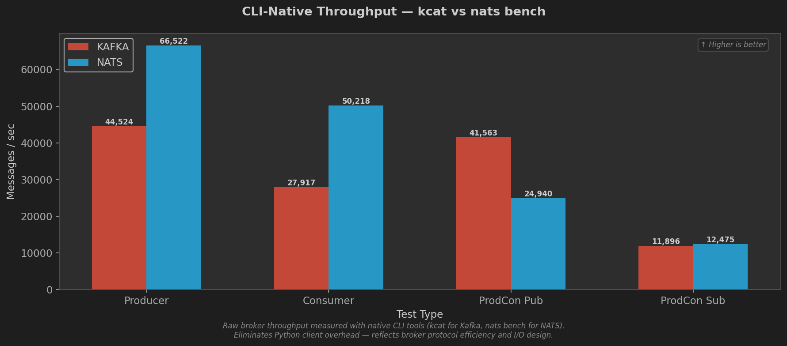

| Test | Kafka (msg/s) | NATS (msg/s) |
|------|---------------|--------------|
| Producer | 44,523.6 | 66,522.0 |
| Consumer | 27,917.4 | 50,218.0 |
| ProdCon (pub) | 41,562.8 | 24,940.0 |
| ProdCon (sub) | 11,896.3 | 12,475.0 |

---

## 4. Latency Under Load

> **What this measures:** End-to-end publish-to-receive latency at 50% of peak throughput. Percentiles (p50, p95, p99, p99.9) show how latency distributes under realistic load. Lower is better — p99 is critical for SLA compliance.

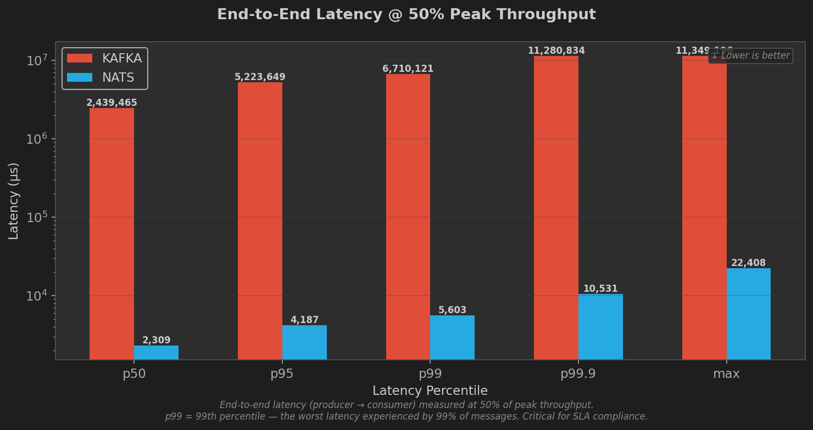

| Percentile | Kafka | NATS |
|------------|-------|------|
| p50 | 2.44 s | 2.3 ms |
| p95 | 5.22 s | 4.2 ms |
| p99 | 6.71 s | 5.6 ms |
| p99.9 | 11.28 s | 10.5 ms |
| max | 11.35 s | 22.4 ms |

---

## 5. Memory Stress

> **What this measures:** Broker stability under progressively restricted Docker memory limits (4g → 512m). For each level the producer benchmark runs and records throughput + errors. PASS = broker stays alive and serves traffic. "Errors" are **produce() call failures** — typically BufferError (producer queue overflow) or broker rejections when memory pressure causes slow message acceptance. NATS shows 0 errors because its backpressure design rejects at the protocol level rather than partially accepting.

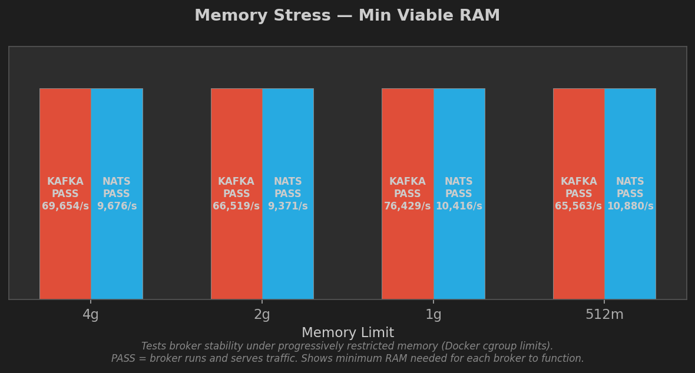

| RAM Level | Kafka | NATS |
|-----------|-------|------|
| 4g | PASS (69,654 msg/s, 480 errs) | PASS (9,676 msg/s, 0 errs) |
| 2g | PASS (66,519 msg/s, 596 errs) | PASS (9,371 msg/s, 0 errs) |
| 1g | PASS (76,429 msg/s, 488 errs) | PASS (10,416 msg/s, 0 errs) |
| 512m | PASS (65,563 msg/s, 718 errs) | PASS (10,880 msg/s, 0 errs) |
| **Min viable** | **512m** | **512m** |

---

## 6. Scorecard

> **What this shows:** A radar/summary chart comparing both brokers across all dimensions (throughput, latency, memory, CPU, errors, stability). Provides an at-a-glance visual comparison.

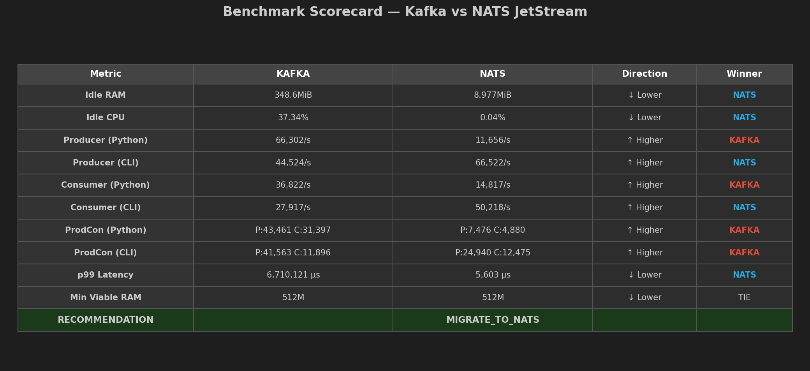

---

## 7. Consumer Throughput

> **What this measures:** Maximum consumer-side message rate using the Python client library. Multiple consumer workers pull messages as fast as possible. Higher is better.

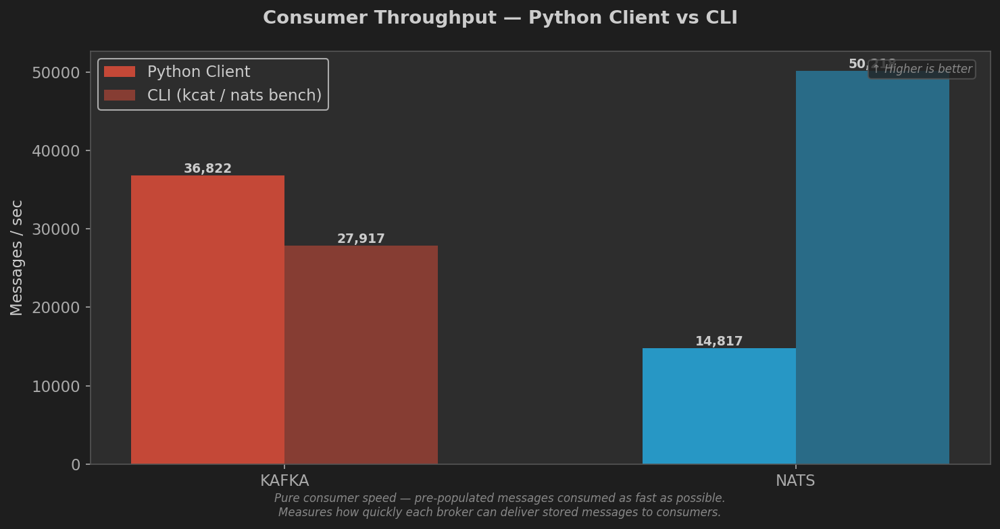

| Run | Kafka (msg/s) | NATS (msg/s) |
|-----|---------------|--------------|
| 1 | 36,821.7 | 14,971.7 |
| 2 | 36,292.4 | 14,817.0 |
| 3 | 39,307.6 | 13,795.0 |
| **Median** | **36,821.7** | **14,817.0** |

---

## 8. Simultaneous Producer + Consumer

> **What this measures:** Throughput when producers and consumers run concurrently (the realistic scenario). Shows whether the broker can handle bidirectional traffic without degradation. The P/C ratio reveals backpressure behaviour. "Producer errors" = failed produce() calls (queue buffer overflow or broker rejection under load).

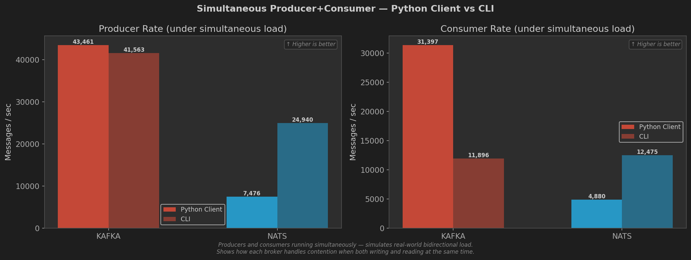

| Metric | Kafka | NATS |
|--------|-------|------|
| Producer rate (msg/s) | 43,461.2 | 7,476.2 |
| Consumer rate (msg/s) | 31,397.4 | 4,879.9 |
| Producer errors | 7,853 | 0 |
| Duration (s) | 611.0 | 600.0 |

---

## 9. Resource Timeline

> **What this shows:** CPU% and memory over time during the full benchmark run, sampled from docker stats. Reveals resource spikes, steady-state usage, and whether the broker releases resources between tests.

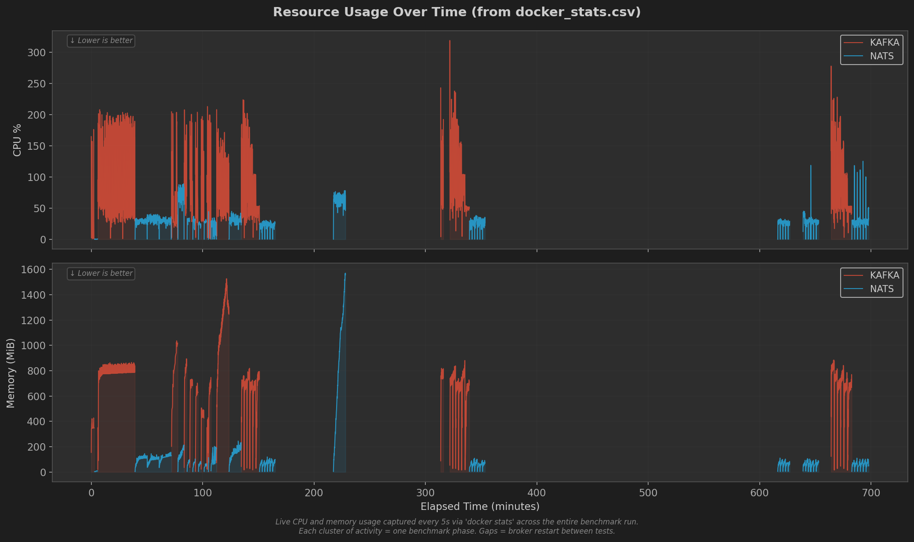

*Data source: docker_stats.csv — continuous sampling during benchmark run.*

---

## 10. Resource Scaling

> **What this measures:** How throughput degrades as CPU cores are progressively restricted (4.0 → 0.5 cores). The "knee" where throughput drops sharply reveals each broker's minimum viable CPU. Flat slope = not CPU-bound; steep drop = CPU bottleneck.

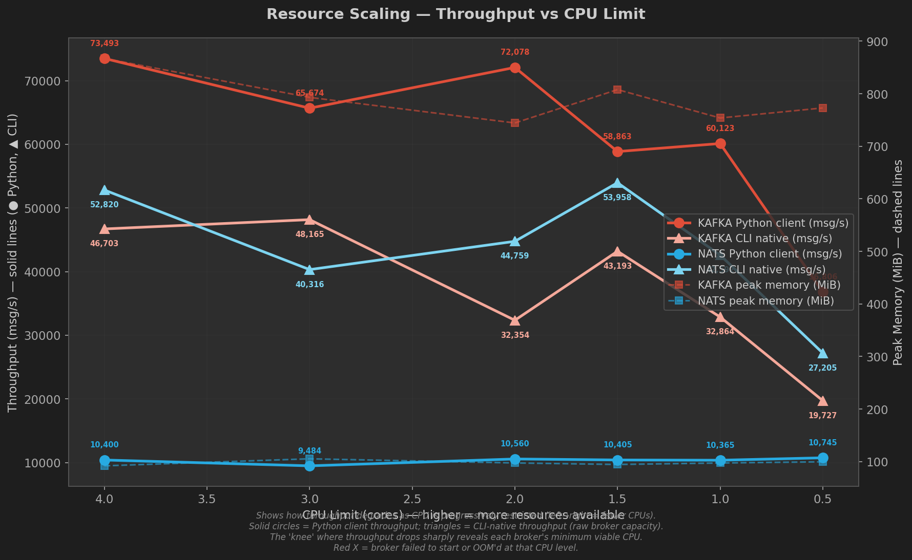

### Kafka

| CPU Limit | Python (msg/s) | CLI (msg/s) | Peak CPU % | Peak Mem (MB) | Status |
|-----------|---------------|-------------|------------|---------------|--------|
| 4.0 | 73,493.0 | 46,702.8 | 220.1 | 867.2 | PASS |
| 3.0 | 65,673.8 | 48,164.9 | 211.6 | 793.1 | PASS |
| 2.0 | 72,077.8 | 32,354.1 | 189.2 | 744.4 | PASS |
| 1.5 | 58,862.7 | 43,192.8 | 148.0 | 807.9 | PASS |
| 1.0 | 60,122.9 | 32,864.5 | 104.7 | 753.9 | PASS |
| 0.5 | 36,805.7 | 19,727.0 | 54.3 | 773.0 | PASS |

### NATS

| CPU Limit | Python (msg/s) | CLI (msg/s) | Peak CPU % | Peak Mem (MB) | Status |
|-----------|---------------|-------------|------------|---------------|--------|
| 4.0 | 10,399.8 | 52,820.0 | 106.4 | 92.0 | PASS |
| 3.0 | 9,483.8 | 40,316.0 | 120.0 | 105.4 | PASS |
| 2.0 | 10,560.5 | 44,759.0 | 123.3 | 97.5 | PASS |
| 1.5 | 10,404.7 | 53,958.0 | 103.6 | 94.6 | PASS |
| 1.0 | 10,364.6 | 42,592.0 | 97.9 | 97.4 | PASS |
| 0.5 | 10,744.6 | 27,205.0 | 50.3 | 99.7 | PASS |

---

## 11. Disk I/O Timeline

> **What this shows:** Block I/O (reads + writes) over time from docker stats. Kafka relies heavily on disk for its commit log; NATS JetStream also persists to disk. Higher disk I/O can indicate storage bottlenecks.

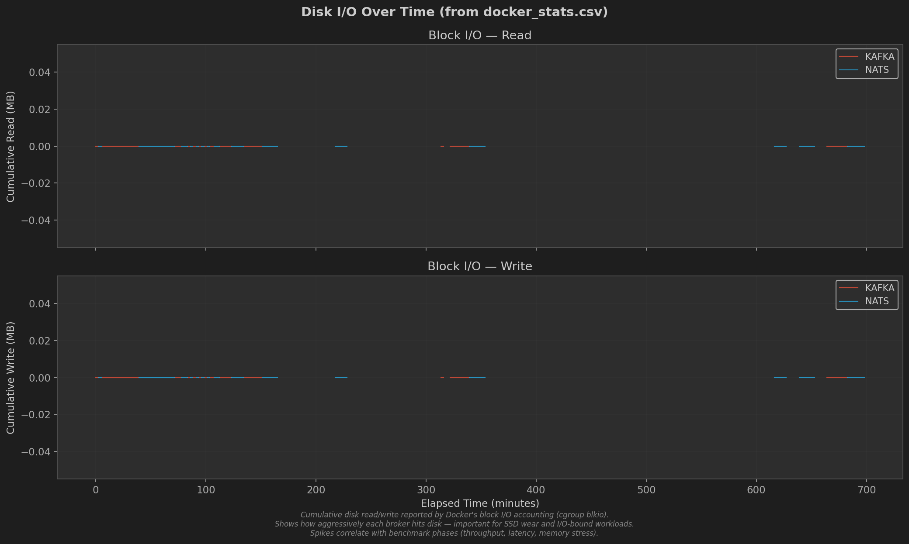

*Data source: docker_stats.csv block_io column.*

---

## 12. Throughput vs Resources

> **What this shows:** Scatter/correlation plot of throughput against CPU and memory usage. Reveals whether higher resource consumption actually translates to higher throughput (efficiency).

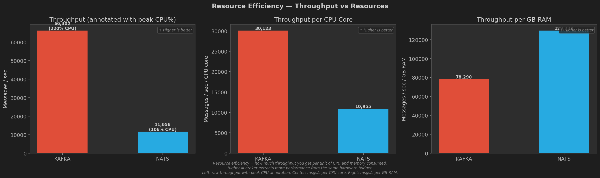

---

## 13. Worker Load Balance

> **What this measures:** How evenly work is distributed across producer/consumer workers. CV% (coefficient of variation) → lower is better. High CV% means some workers are doing much more work than others, indicating partition imbalance or contention.

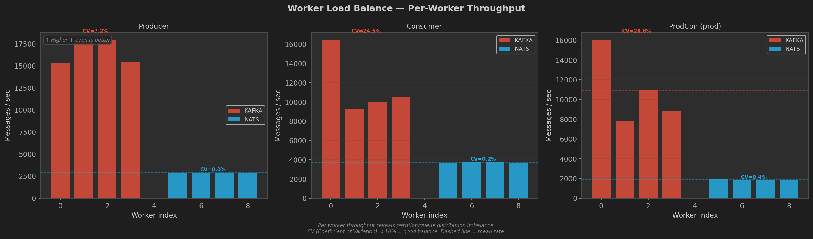

| Test | Broker | Workers | Mean (msg/s) | StdDev | CV% |
|------|--------|---------|-------------|--------|-----|
| Producer | KAFKA | 4 | 16,578 | 1,380 | 8.3 |
| Producer | NATS | 4 | 2,914 | 0 | 0.0 |
| Consumer | KAFKA | 4 | 11,528 | 3,279 | 28.4 |
| Consumer | NATS | 4 | 3,711 | 7 | 0.2 |
| ProdCon (prod) | KAFKA | 4 | 10,898 | 3,625 | 33.3 |
| ProdCon (prod) | NATS | 4 | 1,869 | 8 | 0.4 |

---

## 14. Error Rate Breakdown

> **What this shows:** Total produce() failures across all tests. Kafka errors are typically BufferError (producer queue full) or broker delivery failures under load/memory pressure. NATS uses protocol-level backpressure, so the Python client sees 0 exceptions. Lower is better.

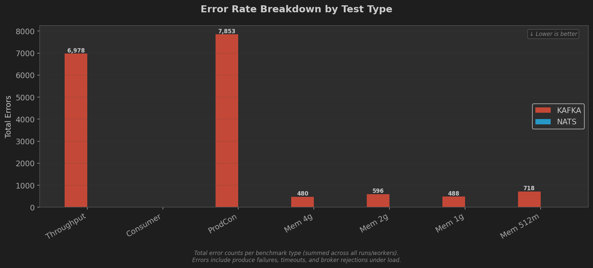

| Test | Kafka Errors | NATS Errors |
|------|-------------|-------------|
| Throughput (all runs) | 6,978 | 0 |
| Consumer (all runs) | 0 | 0 |
| ProdCon | 7,853 | 0 |
| Mem 4g | 480 | 0 |
| Mem 2g | 596 | 0 |
| Mem 1g | 488 | 0 |
| Mem 512m | 718 | 0 |

---

## 15. Throughput Stability Across Repetitions

> **What this measures:** Consistency of throughput across 3 repeated runs. CV% (coefficient of variation) → lower is better. High CV% means results vary significantly between runs, suggesting the broker's performance is sensitive to transient conditions.

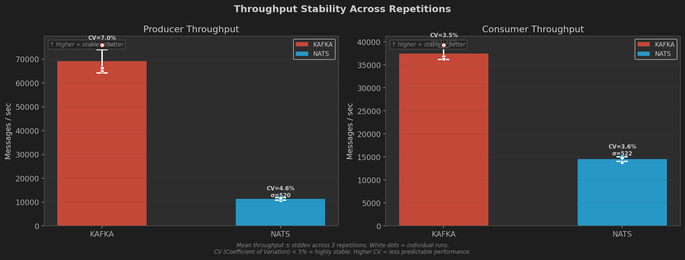

| Test | Broker | Run 1 | Run 2 | Run 3 | Mean | StdDev | CV% |
|------|--------|-------|-------|-------|------|--------|-----|
| Producer | KAFKA | 75,896 | 65,018 | 66,302 | 69,072 | 5,945 | 8.6 |
| Producer | NATS | 10,579 | 11,705 | 11,656 | 11,314 | 636 | 5.6 |
| Consumer | KAFKA | 36,822 | 36,292 | 39,308 | 37,474 | 1,610 | 4.3 |
| Consumer | NATS | 14,972 | 14,817 | 13,795 | 14,528 | 639 | 4.4 |

---

## 16. Producer / Consumer Balance Ratio

> **What this measures:** The ratio of producer-to-consumer throughput during simultaneous operation. A ratio near 1.0x means balanced; >1.0x means the producer outpaces the consumer (messages queue up = backpressure risk).

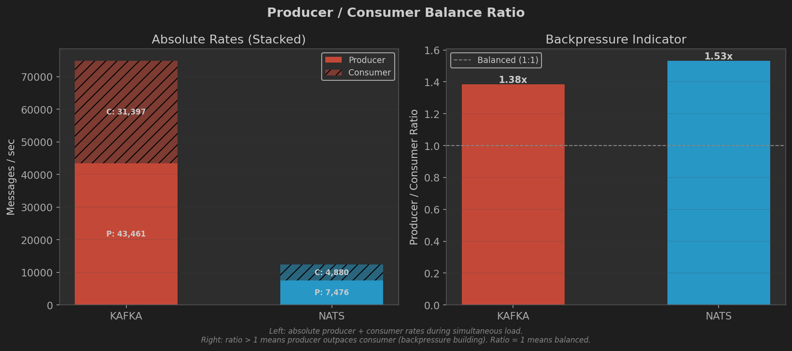

| Broker | Producer (msg/s) | Consumer (msg/s) | Ratio (P/C) | Interpretation |
|--------|-----------------|-----------------|-------------|----------------|
| KAFKA | 43,461 | 31,397 | 1.38x | Producer faster (backpressure) |
| NATS | 7,476 | 4,880 | 1.53x | Producer faster (backpressure) |

---

## 17. Network I/O Timeline

> **What this shows:** Network bytes in/out over time from docker stats. Reveals network bandwidth consumption and whether either broker saturates the network interface.

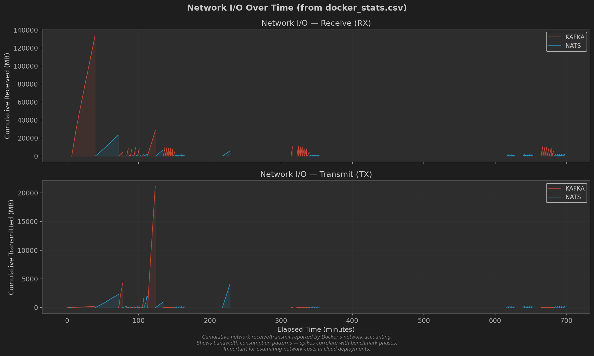

*Data source: docker_stats.csv net_io column.*

---

## 18. Memory Headroom

> **What this shows:** Peak memory usage as a percentage of the container's memory limit over time. Warning at 80%, critical at 95%. Low headroom means the broker is at risk of OOM-kill under load spikes.

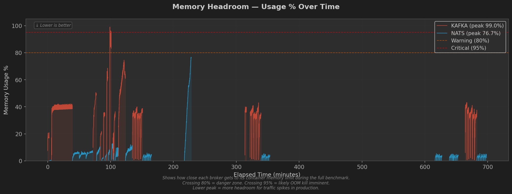

*Data source: docker_stats.csv mem_pct column. Warning threshold: 80%. Critical threshold: 95%.*

---

## 19. Scaling Efficiency — Throughput per CPU Core

> **What this measures:** Throughput normalized per CPU core at each CPU limit. Efficiency >100% means the broker gets more throughput per core when constrained (better utilization). Shows how efficiently each broker uses additional CPU resources.

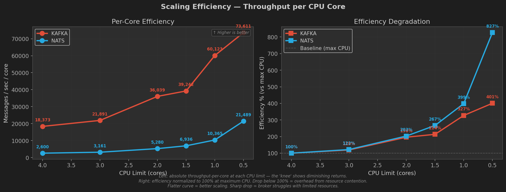

| CPU Limit | Kafka (msg/s/core) | NATS (msg/s/core) | Kafka Eff% | NATS Eff% |
|-----------|-------------------|-------------------|-----------|----------|
| 4.0 | 18,373 | 2,600 | 100% | 100% |
| 3.0 | 21,891 | 3,161 | 119% | 122% |
| 2.0 | 36,039 | 5,280 | 196% | 203% |
| 1.5 | 39,242 | 6,936 | 214% | 267% |
| 1.0 | 60,123 | 10,365 | 327% | 399% |
| 0.5 | 73,611 | 21,489 | 401% | 827% |

---

## 20. Latency Measurement Context

> **What this shows:** The conditions under which latency was measured — load percentage, target rate, number of samples, and the full percentile breakdown in microseconds. This context is critical for interpreting the latency numbers in §4.

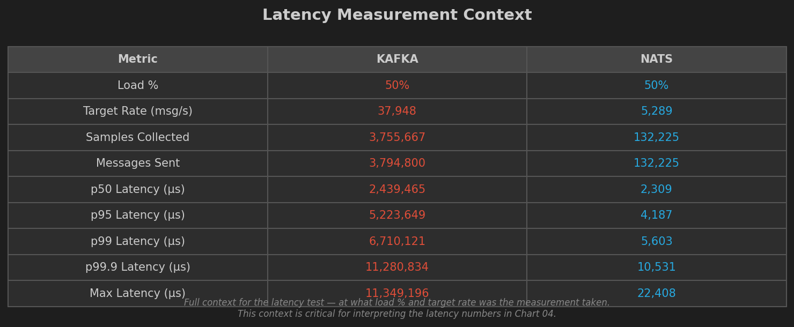

| Metric | Kafka | NATS |
|--------|-------|------|
| Load % | 50% | 50% |
| Target Rate (msg/s) | 37,948 | 5,289 |
| Samples | 3,755,667 | 132,225 |
| Messages Sent | 3,794,800 | 132,225 |
| p50 (µs) | 2,439,465 | 2,309 |
| p95 (µs) | 5,223,649 | 4,187 |
| p99 (µs) | 6,710,121 | 5,603 |
| p99.9 (µs) | 11,280,834 | 10,531 |
| Max (µs) | 11,349,196 | 22,408 |

---

## Decision

**Recommendation: MIGRATE_TO_NATS**

### Reasoning

- Kafka min viable RAM: 512m, NATS min viable RAM: 512m
- Kafka p99=6,710,120.7us, NATS p99=5,602.9us (ratio=1197.62x)
- CLI Throughput — Kafka: 44,523.6 msg/s, NATS: 66,522.0 msg/s (ratio=0.67x)
- Python Client Throughput — Kafka: 66,301.6 msg/s, NATS: 11,656.2 msg/s (reflects client library design, not broker capacity)
- Consumer Throughput — Kafka: 36,821.7 msg/s, NATS: 14,817.0 msg/s (ratio=2.49x)
- ProdCon — Kafka: P=43,461.2/C=31,397.4 msg/s, NATS: P=7,476.2/C=4,879.9 msg/s
- NATS wins both throughput and latency

---

*Report generated: 2026-04-08T19:49:44-04:00*

---

# Knack Benchmark Report: MEDIUM

| Field | Value |
|-------|-------|
| **Scenario** | medium |
| **Run timestamp** | 2026-04-08 17:50:07 |
| **CPUs** | 2.0 |
| **Memory** | 4g |
| **Payload** | 1024 bytes |
| **Producers** | 4 |
| **Consumers** | 4 |

---

## 1. Idle Footprint

> **What this measures:** CPU and memory consumed by each broker when idle (no producers/consumers active). Lower is better — a lighter idle footprint means less wasted resources when your system is between load spikes.

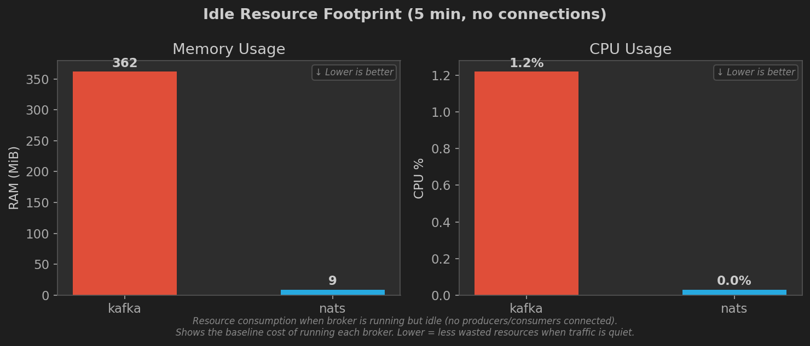

| Metric | Kafka | NATS |
|--------|-------|------|
| CPU | 1.22% | 0.03% |
| Memory | 361.8MiB / 4GiB | 8.828MiB / 4GiB |
| Memory % | 8.83% | 0.22% |

---

## 2. Startup & Recovery

> **What this measures:** Time for the broker to become ready from a cold start, and time to recover after a SIGKILL (simulating a crash). Lower is better — faster recovery means shorter outage windows.

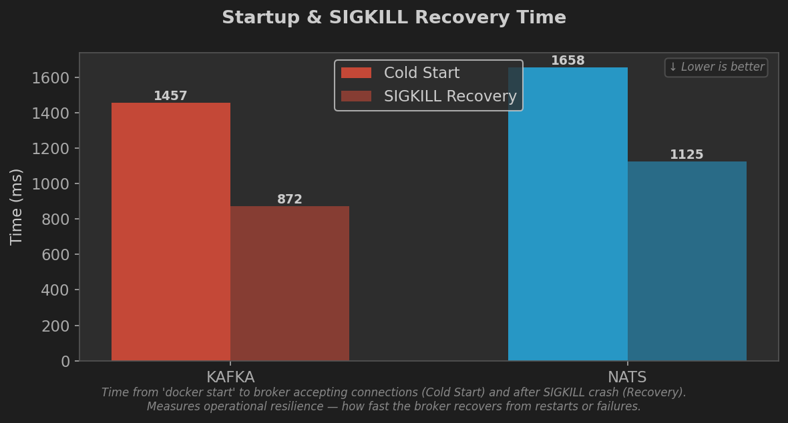

| Metric | Kafka | NATS |
|--------|-------|------|
| Cold start | 1,457 ms | 1,658 ms |
| SIGKILL recovery | 872 ms | 1,125 ms |

---

## 3. Producer Throughput (Python Client)

> **What this measures:** Maximum producer message rate using the Python client library (confluent-kafka for Kafka, nats-py for NATS). Runs multiple producer threads at full speed for a fixed duration. Higher is better, but note this reflects **client library performance** — Python GIL and async overhead affect results. See §3b for raw broker capacity.

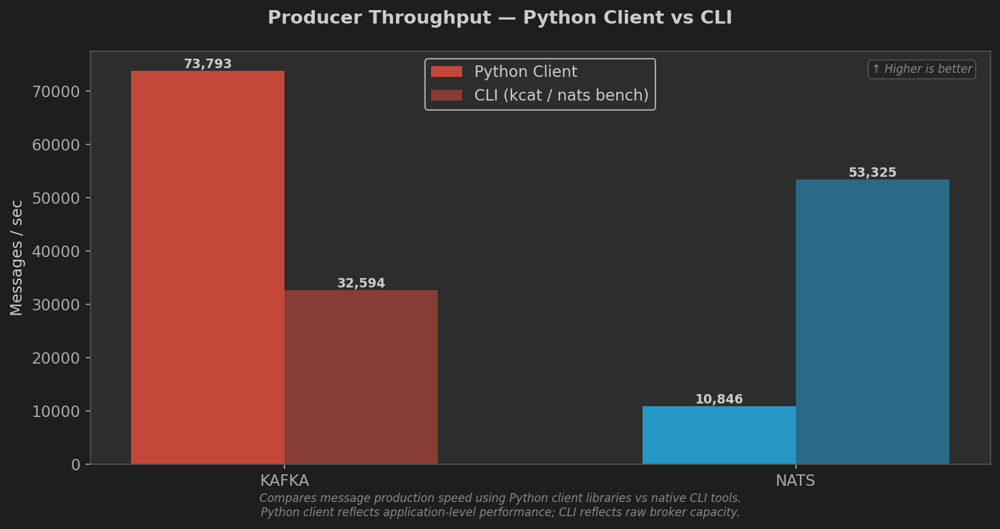

| Run | Kafka (msg/s) | NATS (msg/s) |
|-----|---------------|--------------|
| 1 | 75,376.1 | 10,071.0 |
| 2 | 73,793.0 | 10,846.4 |
| 3 | 58,833.2 | 11,469.5 |
| **Median** | **73,793.0** | **10,846.4** |

---

## 3b. CLI-Native Throughput

> **What this measures:** Raw broker throughput using each broker's optimised CLI tools (kcat for Kafka, nats bench for NATS). These run **on the host** without Python overhead, giving the fairest broker-vs-broker comparison. Higher is better. The decision engine uses these numbers (not Python client numbers) for the throughput comparison.

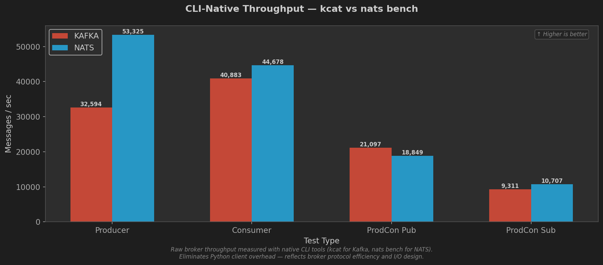

| Test | Kafka (msg/s) | NATS (msg/s) |
|------|---------------|--------------|
| Producer | 32,594.5 | 53,325.0 |
| Consumer | 40,883.1 | 44,678.0 |
| ProdCon (pub) | 21,097.0 | 18,849.0 |
| ProdCon (sub) | 9,311.0 | 10,707.0 |

---

## 4. Latency Under Load

> **What this measures:** End-to-end publish-to-receive latency at 50% of peak throughput. Percentiles (p50, p95, p99, p99.9) show how latency distributes under realistic load. Lower is better — p99 is critical for SLA compliance.

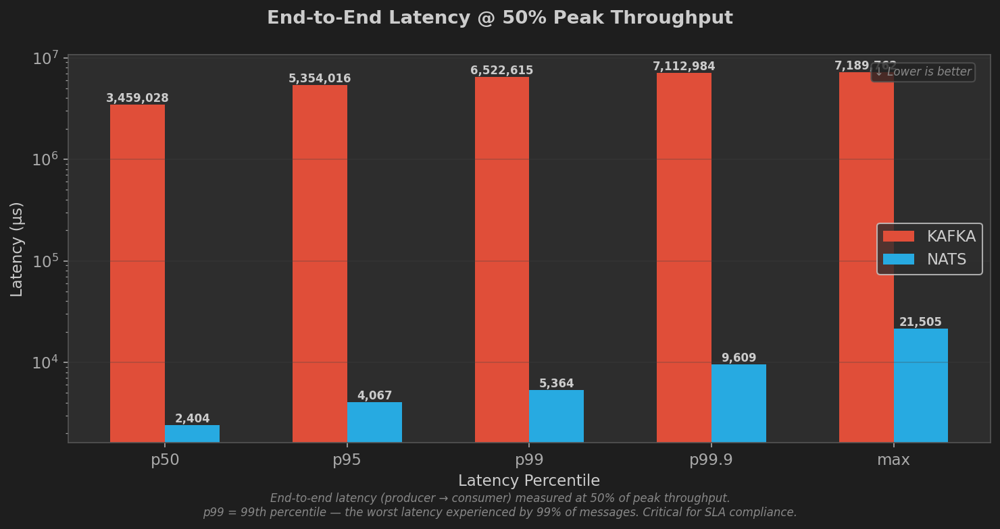

| Percentile | Kafka | NATS |
|------------|-------|------|
| p50 | 3.46 s | 2.4 ms |
| p95 | 5.35 s | 4.1 ms |
| p99 | 6.52 s | 5.4 ms |
| p99.9 | 7.11 s | 9.6 ms |
| max | 7.19 s | 21.5 ms |

---

## 5. Memory Stress

> **What this measures:** Broker stability under progressively restricted Docker memory limits (4g → 512m). For each level the producer benchmark runs and records throughput + errors. PASS = broker stays alive and serves traffic. "Errors" are **produce() call failures** — typically BufferError (producer queue overflow) or broker rejections when memory pressure causes slow message acceptance. NATS shows 0 errors because its backpressure design rejects at the protocol level rather than partially accepting.

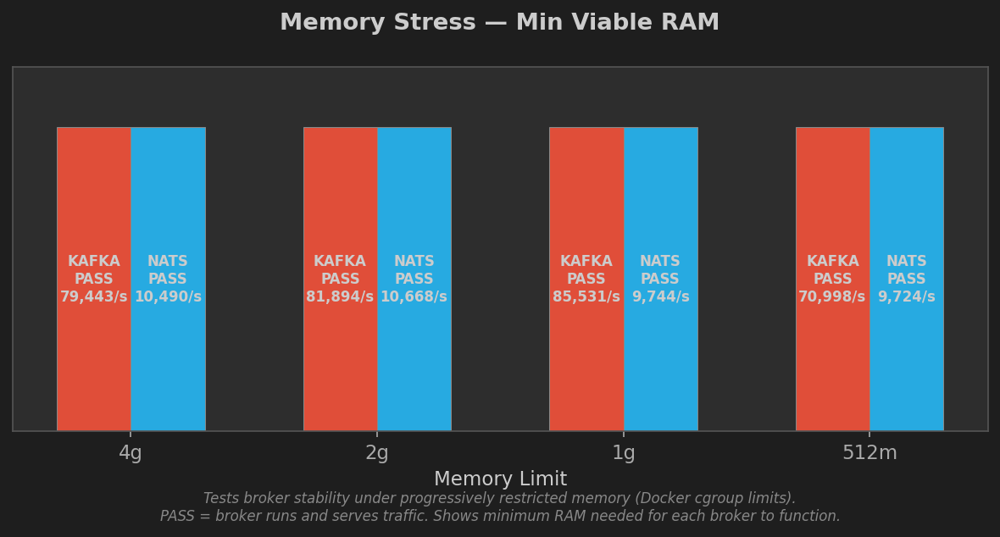

| RAM Level | Kafka | NATS |
|-----------|-------|------|
| 4g | PASS (79,443 msg/s, 186 errs) | PASS (10,490 msg/s, 0 errs) |
| 2g | PASS (81,894 msg/s, 106 errs) | PASS (10,668 msg/s, 0 errs) |
| 1g | PASS (85,531 msg/s, 132 errs) | PASS (9,744 msg/s, 0 errs) |
| 512m | PASS (70,998 msg/s, 425 errs) | PASS (9,724 msg/s, 0 errs) |
| **Min viable** | **512m** | **512m** |

---

## 6. Scorecard

> **What this shows:** A radar/summary chart comparing both brokers across all dimensions (throughput, latency, memory, CPU, errors, stability). Provides an at-a-glance visual comparison.

---

## 7. Consumer Throughput

> **What this measures:** Maximum consumer-side message rate using the Python client library. Multiple consumer workers pull messages as fast as possible. Higher is better.

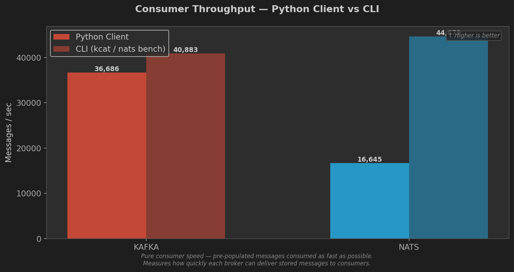

| Run | Kafka (msg/s) | NATS (msg/s) |
|-----|---------------|--------------|
| 1 | 29,262.0 | 16,644.6 |
| 2 | 36,686.2 | 16,399.9 |
| 3 | 49,696.4 | 17,028.5 |
| **Median** | **36,686.2** | **16,644.6** |

---

## 8. Simultaneous Producer + Consumer

> **What this measures:** Throughput when producers and consumers run concurrently (the realistic scenario). Shows whether the broker can handle bidirectional traffic without degradation. The P/C ratio reveals backpressure behaviour. "Producer errors" = failed produce() calls (queue buffer overflow or broker rejection under load).

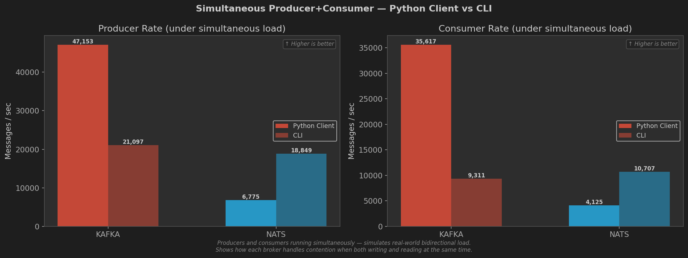

| Metric | Kafka | NATS |
|--------|-------|------|
| Producer rate (msg/s) | 47,153.0 | 6,774.9 |
| Consumer rate (msg/s) | 35,617.1 | 4,124.6 |
| Producer errors | 9,639 | 0 |
| Duration (s) | 611.6 | 600.1 |

---

## 9. Resource Timeline

> **What this shows:** CPU% and memory over time during the full benchmark run, sampled from docker stats. Reveals resource spikes, steady-state usage, and whether the broker releases resources between tests.

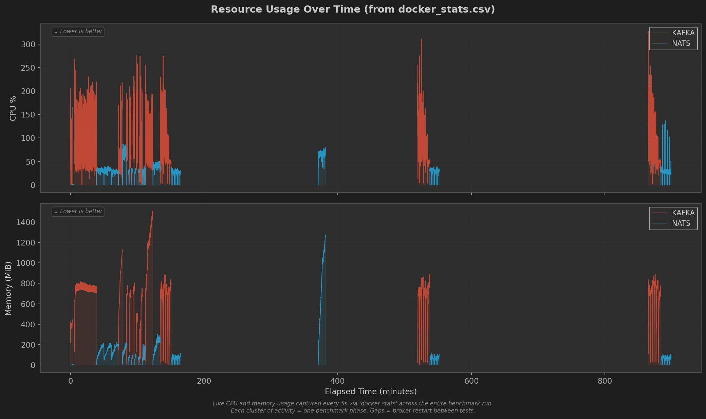

*Data source: docker_stats.csv — continuous sampling during benchmark run.*

---

## 10. Resource Scaling

> **What this measures:** How throughput degrades as CPU cores are progressively restricted (4.0 → 0.5 cores). The "knee" where throughput drops sharply reveals each broker's minimum viable CPU. Flat slope = not CPU-bound; steep drop = CPU bottleneck.

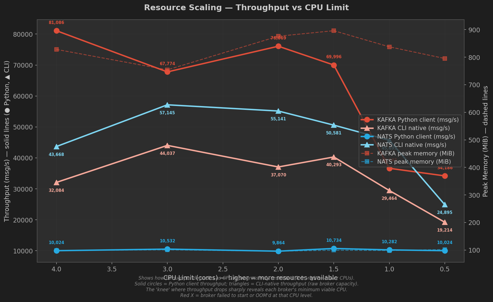

### Kafka

| CPU Limit | Python (msg/s) | CLI (msg/s) | Peak CPU % | Peak Mem (MB) | Status |
|-----------|---------------|-------------|------------|---------------|--------|
| 4.0 | 81,086.1 | 32,084.2 | 238.2 | 828.2 | PASS |
| 3.0 | 67,774.3 | 44,037.3 | 203.5 | 754.1 | PASS |
| 2.0 | 76,069.4 | 37,070.0 | 196.0 | 876.2 | PASS |
| 1.5 | 69,996.2 | 40,293.3 | 157.1 | 896.2 | PASS |
| 1.0 | 36,643.4 | 29,463.8 | 106.0 | 837.7 | PASS |
| 0.5 | 34,186.4 | 19,213.8 | 52.7 | 795.3 | PASS |

### NATS

| CPU Limit | Python (msg/s) | CLI (msg/s) | Peak CPU % | Peak Mem (MB) | Status |
|-----------|---------------|-------------|------------|---------------|--------|
| 4.0 | 10,024.1 | 43,668.0 | 131.9 | 98.3 | PASS |
| 3.0 | 10,532.0 | 57,145.0 | 122.8 | 100.8 | PASS |
| 2.0 | 9,864.3 | 55,141.0 | 115.4 | 95.8 | PASS |
| 1.5 | 10,734.5 | 50,581.0 | 107.1 | 99.3 | PASS |
| 1.0 | 10,281.5 | 45,693.0 | 100.5 | 98.2 | PASS |
| 0.5 | 10,024.2 | 24,895.0 | 51.7 | 101.8 | PASS |

---

## 11. Disk I/O Timeline

> **What this shows:** Block I/O (reads + writes) over time from docker stats. Kafka relies heavily on disk for its commit log; NATS JetStream also persists to disk. Higher disk I/O can indicate storage bottlenecks.

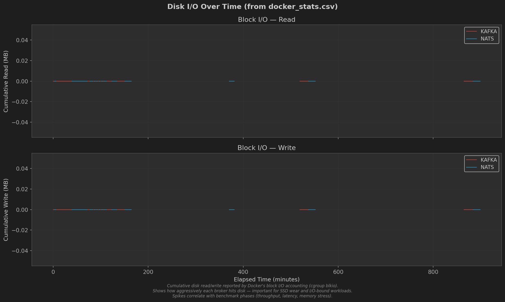

*Data source: docker_stats.csv block_io column.*

---

## 12. Throughput vs Resources

> **What this shows:** Scatter/correlation plot of throughput against CPU and memory usage. Reveals whether higher resource consumption actually translates to higher throughput (efficiency).

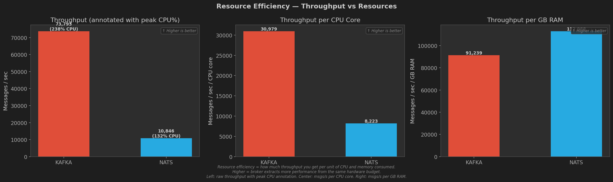

---

## 13. Worker Load Balance

> **What this measures:** How evenly work is distributed across producer/consumer workers. CV% (coefficient of variation) → lower is better. High CV% means some workers are doing much more work than others, indicating partition imbalance or contention.

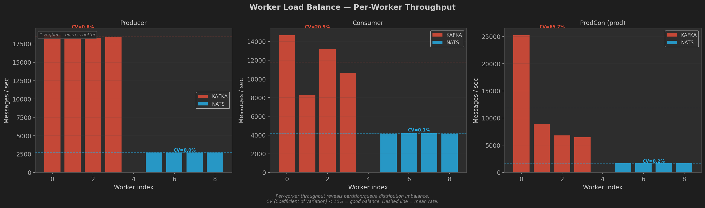

| Test | Broker | Workers | Mean (msg/s) | StdDev | CV% |
|------|--------|---------|-------------|--------|-----|
| Producer | KAFKA | 4 | 18,459 | 164 | 0.9 |
| Producer | NATS | 4 | 2,712 | 0 | 0.0 |
| Consumer | KAFKA | 4 | 11,704 | 2,821 | 24.1 |
| Consumer | NATS | 4 | 4,167 | 5 | 0.1 |
| ProdCon (prod) | KAFKA | 4 | 11,847 | 8,993 | 75.9 |
| ProdCon (prod) | NATS | 4 | 1,694 | 4 | 0.3 |

---

## 14. Error Rate Breakdown

> **What this shows:** Total produce() failures across all tests. Kafka errors are typically BufferError (producer queue full) or broker delivery failures under load/memory pressure. NATS uses protocol-level backpressure, so the Python client sees 0 exceptions. Lower is better.

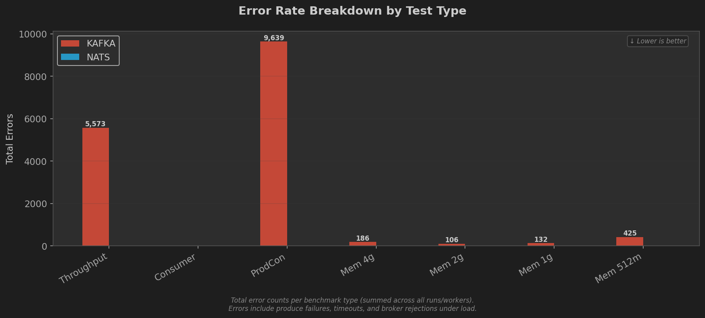

| Test | Kafka Errors | NATS Errors |
|------|-------------|-------------|
| Throughput (all runs) | 5,573 | 0 |
| Consumer (all runs) | 0 | 0 |
| ProdCon | 9,639 | 0 |
| Mem 4g | 186 | 0 |
| Mem 2g | 106 | 0 |
| Mem 1g | 132 | 0 |
| Mem 512m | 425 | 0 |

---

## 15. Throughput Stability Across Repetitions

> **What this measures:** Consistency of throughput across 3 repeated runs. CV% (coefficient of variation) → lower is better. High CV% means results vary significantly between runs, suggesting the broker's performance is sensitive to transient conditions.

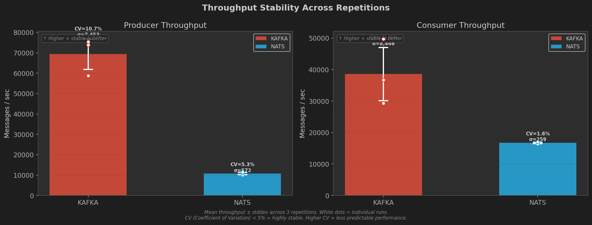

| Test | Broker | Run 1 | Run 2 | Run 3 | Mean | StdDev | CV% |
|------|--------|-------|-------|-------|------|--------|-----|
| Producer | KAFKA | 75,376 | 73,793 | 58,833 | 69,334 | 9,128 | 13.2 |
| Producer | NATS | 10,071 | 10,846 | 11,470 | 10,796 | 701 | 6.5 |
| Consumer | KAFKA | 29,262 | 36,686 | 49,696 | 38,548 | 10,344 | 26.8 |
| Consumer | NATS | 16,645 | 16,400 | 17,028 | 16,691 | 317 | 1.9 |

---

## 16. Producer / Consumer Balance Ratio

> **What this measures:** The ratio of producer-to-consumer throughput during simultaneous operation. A ratio near 1.0x means balanced; >1.0x means the producer outpaces the consumer (messages queue up = backpressure risk).

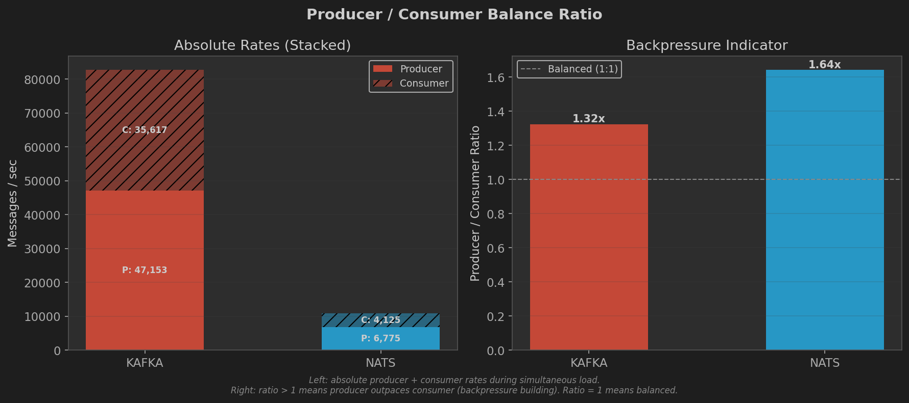

| Broker | Producer (msg/s) | Consumer (msg/s) | Ratio (P/C) | Interpretation |
|--------|-----------------|-----------------|-------------|----------------|
| KAFKA | 47,153 | 35,617 | 1.32x | Producer faster (backpressure) |
| NATS | 6,775 | 4,125 | 1.64x | Producer faster (backpressure) |

---

## 17. Network I/O Timeline

> **What this shows:** Network bytes in/out over time from docker stats. Reveals network bandwidth consumption and whether either broker saturates the network interface.

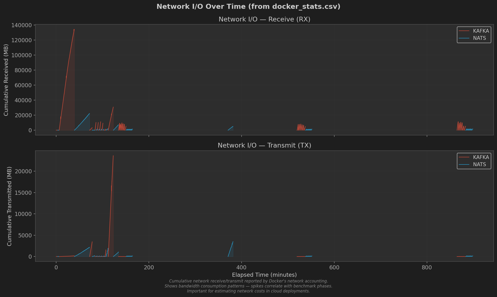

*Data source: docker_stats.csv net_io column.*

---

## 18. Memory Headroom

> **What this shows:** Peak memory usage as a percentage of the container's memory limit over time. Warning at 80%, critical at 95%. Low headroom means the broker is at risk of OOM-kill under load spikes.

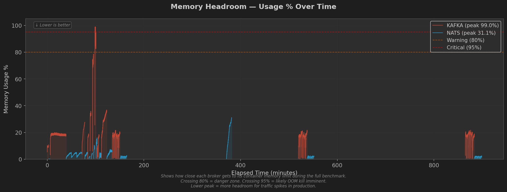

*Data source: docker_stats.csv mem_pct column. Warning threshold: 80%. Critical threshold: 95%.*

---

## 19. Scaling Efficiency — Throughput per CPU Core

> **What this measures:** Throughput normalized per CPU core at each CPU limit. Efficiency >100% means the broker gets more throughput per core when constrained (better utilization). Shows how efficiently each broker uses additional CPU resources.

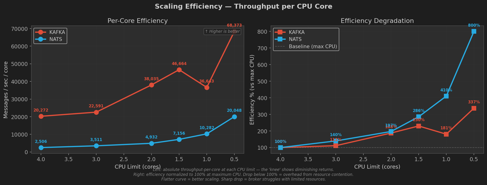

| CPU Limit | Kafka (msg/s/core) | NATS (msg/s/core) | Kafka Eff% | NATS Eff% |
|-----------|-------------------|-------------------|-----------|----------|
| 4.0 | 20,272 | 2,506 | 100% | 100% |
| 3.0 | 22,591 | 3,511 | 111% | 140% |
| 2.0 | 38,035 | 4,932 | 188% | 197% |
| 1.5 | 46,664 | 7,156 | 230% | 286% |
| 1.0 | 36,643 | 10,282 | 181% | 410% |
| 0.5 | 68,373 | 20,048 | 337% | 800% |

---

## 20. Latency Measurement Context

> **What this shows:** The conditions under which latency was measured — load percentage, target rate, number of samples, and the full percentile breakdown in microseconds. This context is critical for interpreting the latency numbers in §4.

| Metric | Kafka | NATS |
|--------|-------|------|
| Load % | 50% | 50% |
| Target Rate (msg/s) | 37,688 | 5,035 |
| Samples | 3,090,390 | 130,910 |
| Messages Sent | 3,165,792 | 130,910 |
| p50 (µs) | 3,459,028 | 2,404 |
| p95 (µs) | 5,354,016 | 4,067 |
| p99 (µs) | 6,522,615 | 5,364 |
| p99.9 (µs) | 7,112,984 | 9,609 |
| Max (µs) | 7,189,762 | 21,505 |

---

## Decision

**Recommendation: MIGRATE_TO_NATS**

### Reasoning

- Kafka min viable RAM: 512m, NATS min viable RAM: 512m
- Kafka p99=6,522,614.8us, NATS p99=5,364.3us (ratio=1215.93x)
- CLI Throughput — Kafka: 32,594.5 msg/s, NATS: 53,325.0 msg/s (ratio=0.61x)
- Python Client Throughput — Kafka: 73,793.0 msg/s, NATS: 10,846.4 msg/s (reflects client library design, not broker capacity)
- Consumer Throughput — Kafka: 36,686.2 msg/s, NATS: 16,644.6 msg/s (ratio=2.20x)
- ProdCon — Kafka: P=47,153.0/C=35,617.1 msg/s, NATS: P=6,774.9/C=4,124.6 msg/s
- NATS wins both throughput and latency

---

*Report generated: 2026-04-08T19:49:42-04:00*

---

# Knack Benchmark Report: LARGE

| Field | Value |
|-------|-------|
| **Scenario** | large |
| **Run timestamp** | 2026-04-08 19:14:19 |
| **CPUs** | 2.0 |
| **Memory** | 4g |
| **Payload** | 1024 bytes |
| **Producers** | 4 |
| **Consumers** | 4 |

---

## 1. Idle Footprint

> **What this measures:** CPU and memory consumed by each broker when idle (no producers/consumers active). Lower is better — a lighter idle footprint means less wasted resources when your system is between load spikes.

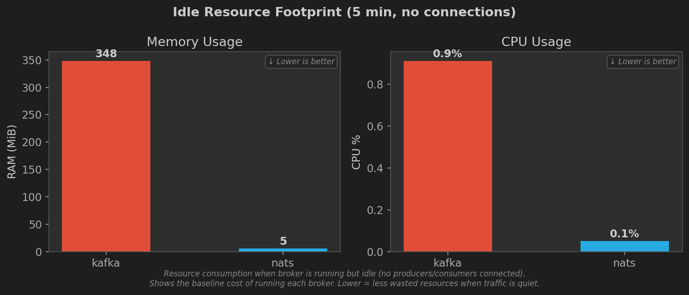

| Metric | Kafka | NATS |
|--------|-------|------|
| CPU | 0.91% | 0.05% |
| Memory | 347.7MiB / 7.761GiB | 5.395MiB / 7.761GiB |
| Memory % | 4.38% | 0.07% |

---

## 2. Startup & Recovery

> **What this measures:** Time for the broker to become ready from a cold start, and time to recover after a SIGKILL (simulating a crash). Lower is better — faster recovery means shorter outage windows.

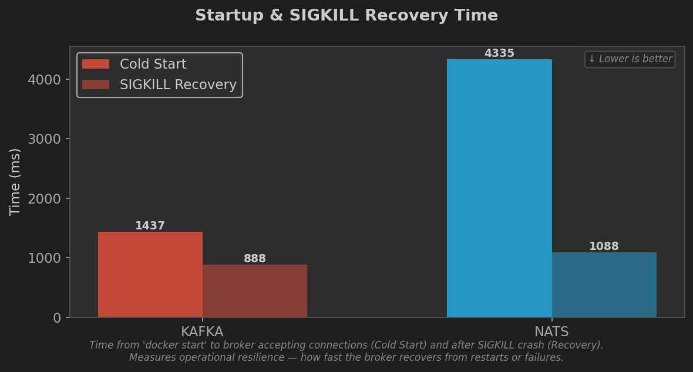

| Metric | Kafka | NATS |
|--------|-------|------|
| Cold start | 1,437 ms | 4,335 ms |
| SIGKILL recovery | 888 ms | 1,088 ms |

---

## 3. Producer Throughput (Python Client)

> **What this measures:** Maximum producer message rate using the Python client library (confluent-kafka for Kafka, nats-py for NATS). Runs multiple producer threads at full speed for a fixed duration. Higher is better, but note this reflects **client library performance** — Python GIL and async overhead affect results. See §3b for raw broker capacity.

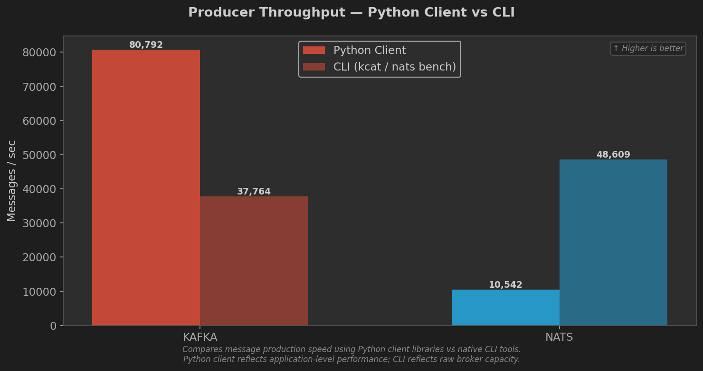

| Run | Kafka (msg/s) | NATS (msg/s) |
|-----|---------------|--------------|
| 1 | 83,002.1 | 10,541.8 |
| 2 | 80,792.0 | 10,124.6 |
| 3 | 79,437.5 | 11,965.9 |
| **Median** | **80,792.0** | **10,541.8** |

---

## 3b. CLI-Native Throughput

> **What this measures:** Raw broker throughput using each broker's optimised CLI tools (kcat for Kafka, nats bench for NATS). These run **on the host** without Python overhead, giving the fairest broker-vs-broker comparison. Higher is better. The decision engine uses these numbers (not Python client numbers) for the throughput comparison.

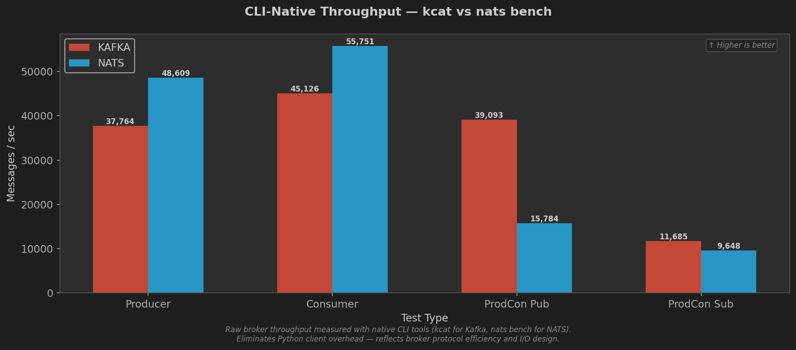

| Test | Kafka (msg/s) | NATS (msg/s) |
|------|---------------|--------------|
| Producer | 37,764.4 | 48,609.0 |
| Consumer | 45,126.4 | 55,751.0 |
| ProdCon (pub) | 39,093.0 | 15,784.0 |
| ProdCon (sub) | 11,685.0 | 9,648.0 |

---

## 4. Latency Under Load

> **What this measures:** End-to-end publish-to-receive latency at 50% of peak throughput. Percentiles (p50, p95, p99, p99.9) show how latency distributes under realistic load. Lower is better — p99 is critical for SLA compliance.

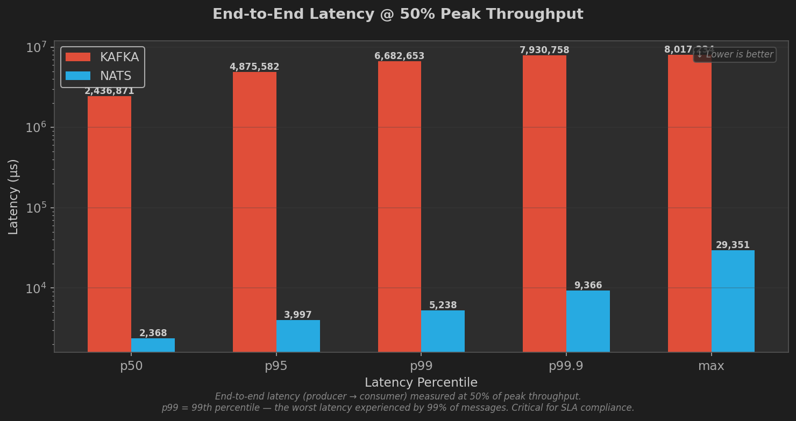

| Percentile | Kafka | NATS |
|------------|-------|------|
| p50 | 2.44 s | 2.4 ms |
| p95 | 4.88 s | 4.0 ms |
| p99 | 6.68 s | 5.2 ms |
| p99.9 | 7.93 s | 9.4 ms |
| max | 8.02 s | 29.4 ms |

---

## 5. Memory Stress

> **What this measures:** Broker stability under progressively restricted Docker memory limits (4g → 512m). For each level the producer benchmark runs and records throughput + errors. PASS = broker stays alive and serves traffic. "Errors" are **produce() call failures** — typically BufferError (producer queue overflow) or broker rejections when memory pressure causes slow message acceptance. NATS shows 0 errors because its backpressure design rejects at the protocol level rather than partially accepting.

| RAM Level | Kafka | NATS |
|-----------|-------|------|
| 4g | PASS (84,000 msg/s, 163 errs) | PASS (10,210 msg/s, 0 errs) |
| 2g | PASS (79,005 msg/s, 278 errs) | PASS (10,711 msg/s, 0 errs) |
| 1g | PASS (83,075 msg/s, 220 errs) | PASS (10,619 msg/s, 0 errs) |
| 512m | PASS (73,540 msg/s, 379 errs) | PASS (10,072 msg/s, 0 errs) |
| **Min viable** | **512m** | **512m** |

---

## 6. Scorecard

> **What this shows:** A radar/summary chart comparing both brokers across all dimensions (throughput, latency, memory, CPU, errors, stability). Provides an at-a-glance visual comparison.

---

## 7. Consumer Throughput

> **What this measures:** Maximum consumer-side message rate using the Python client library. Multiple consumer workers pull messages as fast as possible. Higher is better.

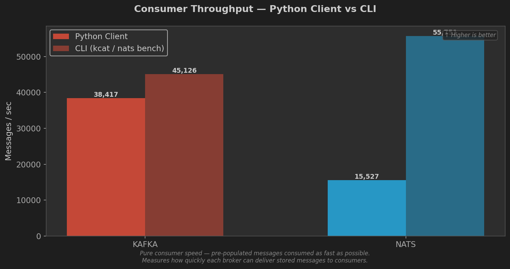

| Run | Kafka (msg/s) | NATS (msg/s) |
|-----|---------------|--------------|
| 1 | 38,417.4 | 15,527.4 |
| 2 | 38,192.7 | 15,460.4 |
| 3 | 38,719.0 | 16,437.5 |
| **Median** | **38,417.4** | **15,527.4** |

---

## 8. Simultaneous Producer + Consumer

> **What this measures:** Throughput when producers and consumers run concurrently (the realistic scenario). Shows whether the broker can handle bidirectional traffic without degradation. The P/C ratio reveals backpressure behaviour. "Producer errors" = failed produce() calls (queue buffer overflow or broker rejection under load).

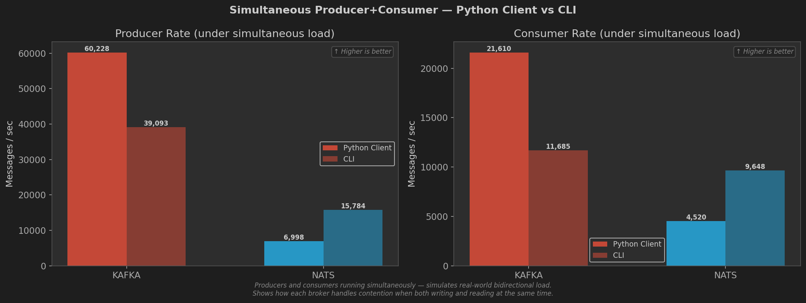

| Metric | Kafka | NATS |
|--------|-------|------|
| Producer rate (msg/s) | 60,227.6 | 6,998.2 |
| Consumer rate (msg/s) | 21,610.4 | 4,520.1 |
| Producer errors | 4,048 | 0 |
| Duration (s) | 612.6 | 600.1 |

---

## 9. Resource Timeline

> **What this shows:** CPU% and memory over time during the full benchmark run, sampled from docker stats. Reveals resource spikes, steady-state usage, and whether the broker releases resources between tests.

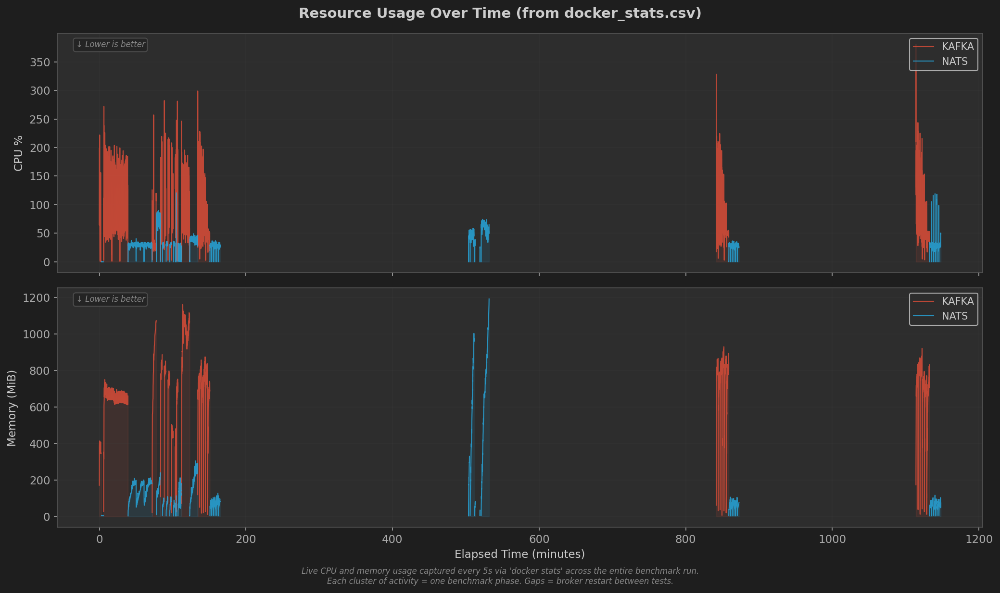

*Data source: docker_stats.csv — continuous sampling during benchmark run.*

---

## 10. Resource Scaling

> **What this measures:** How throughput degrades as CPU cores are progressively restricted (4.0 → 0.5 cores). The "knee" where throughput drops sharply reveals each broker's minimum viable CPU. Flat slope = not CPU-bound; steep drop = CPU bottleneck.

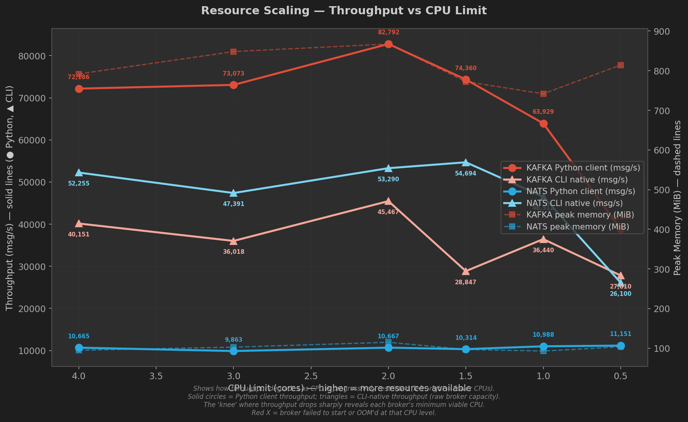

### Kafka

| CPU Limit | Python (msg/s) | CLI (msg/s) | Peak CPU % | Peak Mem (MB) | Status |
|-----------|---------------|-------------|------------|---------------|--------|
| 4.0 | 72,186.4 | 40,151.0 | 217.2 | 791.9 | PASS |
| 3.0 | 73,073.0 | 36,017.9 | 196.1 | 848.2 | PASS |
| 2.0 | 82,792.4 | 45,466.9 | 192.2 | 867.4 | PASS |
| 1.5 | 74,360.2 | 28,846.7 | 155.3 | 772.5 | PASS |
| 1.0 | 63,929.2 | 36,440.5 | 103.7 | 741.7 | PASS |
| 0.5 | 38,847.9 | 27,810.2 | 54.3 | 814.3 | PASS |

### NATS

| CPU Limit | Python (msg/s) | CLI (msg/s) | Peak CPU % | Peak Mem (MB) | Status |
|-----------|---------------|-------------|------------|---------------|--------|
| 4.0 | 10,664.6 | 52,255.0 | 121.9 | 94.9 | PASS |
| 3.0 | 9,862.6 | 47,391.0 | 127.2 | 102.6 | PASS |
| 2.0 | 10,667.0 | 53,290.0 | 122.8 | 114.9 | PASS |
| 1.5 | 10,314.0 | 54,694.0 | 118.3 | 96.7 | PASS |
| 1.0 | 10,987.6 | 46,512.0 | 98.4 | 92.8 | PASS |
| 0.5 | 11,150.9 | 26,100.0 | 50.7 | 103.4 | PASS |

---

## 11. Disk I/O Timeline

> **What this shows:** Block I/O (reads + writes) over time from docker stats. Kafka relies heavily on disk for its commit log; NATS JetStream also persists to disk. Higher disk I/O can indicate storage bottlenecks.

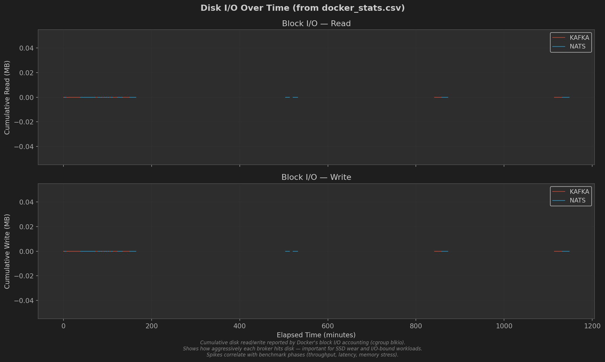

*Data source: docker_stats.csv block_io column.*

---

## 12. Throughput vs Resources

> **What this shows:** Scatter/correlation plot of throughput against CPU and memory usage. Reveals whether higher resource consumption actually translates to higher throughput (efficiency).

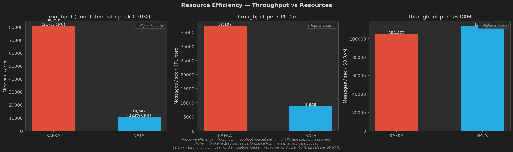

---

## 13. Worker Load Balance

> **What this measures:** How evenly work is distributed across producer/consumer workers. CV% (coefficient of variation) → lower is better. High CV% means some workers are doing much more work than others, indicating partition imbalance or contention.

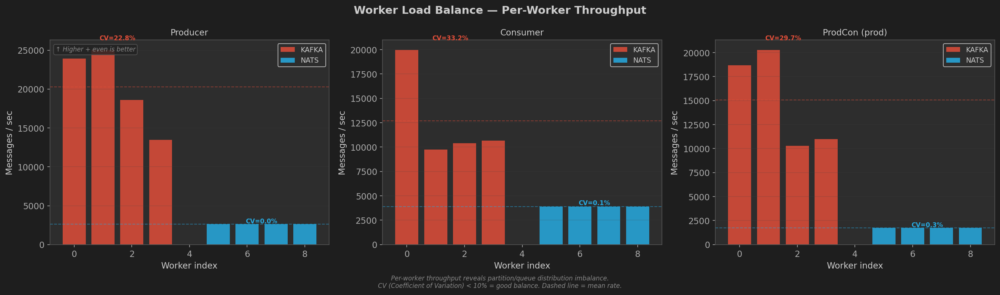

| Test | Broker | Workers | Mean (msg/s) | StdDev | CV% |
|------|--------|---------|-------------|--------|-----|
| Producer | KAFKA | 4 | 20,259 | 5,342 | 26.4 |
| Producer | NATS | 4 | 2,636 | 0 | 0.0 |
| Consumer | KAFKA | 4 | 12,698 | 4,872 | 38.4 |
| Consumer | NATS | 4 | 3,885 | 4 | 0.1 |
| ProdCon (prod) | KAFKA | 4 | 15,058 | 5,162 | 34.3 |
| ProdCon (prod) | NATS | 4 | 1,750 | 6 | 0.3 |

---

## 14. Error Rate Breakdown

> **What this shows:** Total produce() failures across all tests. Kafka errors are typically BufferError (producer queue full) or broker delivery failures under load/memory pressure. NATS uses protocol-level backpressure, so the Python client sees 0 exceptions. Lower is better.

| Test | Kafka Errors | NATS Errors |
|------|-------------|-------------|
| Throughput (all runs) | 2,144 | 0 |
| Consumer (all runs) | 0 | 0 |
| ProdCon | 4,048 | 0 |
| Mem 4g | 163 | 0 |
| Mem 2g | 278 | 0 |
| Mem 1g | 220 | 0 |
| Mem 512m | 379 | 0 |

---

## 15. Throughput Stability Across Repetitions

> **What this measures:** Consistency of throughput across 3 repeated runs. CV% (coefficient of variation) → lower is better. High CV% means results vary significantly between runs, suggesting the broker's performance is sensitive to transient conditions.

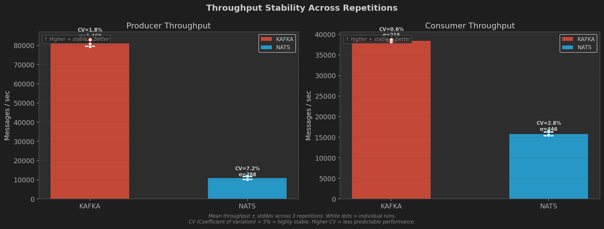

| Test | Broker | Run 1 | Run 2 | Run 3 | Mean | StdDev | CV% |
|------|--------|-------|-------|-------|------|--------|-----|
| Producer | KAFKA | 83,002 | 80,792 | 79,438 | 81,077 | 1,799 | 2.2 |
| Producer | NATS | 10,542 | 10,125 | 11,966 | 10,877 | 965 | 8.9 |
| Consumer | KAFKA | 38,417 | 38,193 | 38,719 | 38,443 | 264 | 0.7 |
| Consumer | NATS | 15,527 | 15,460 | 16,438 | 15,808 | 546 | 3.5 |

---

## 16. Producer / Consumer Balance Ratio

> **What this measures:** The ratio of producer-to-consumer throughput during simultaneous operation. A ratio near 1.0x means balanced; >1.0x means the producer outpaces the consumer (messages queue up = backpressure risk).

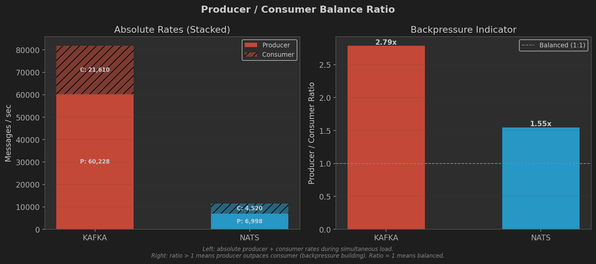

| Broker | Producer (msg/s) | Consumer (msg/s) | Ratio (P/C) | Interpretation |
|--------|-----------------|-----------------|-------------|----------------|
| KAFKA | 60,228 | 21,610 | 2.79x | Producer faster (backpressure) |
| NATS | 6,998 | 4,520 | 1.55x | Producer faster (backpressure) |

---

## 17. Network I/O Timeline

> **What this shows:** Network bytes in/out over time from docker stats. Reveals network bandwidth consumption and whether either broker saturates the network interface.

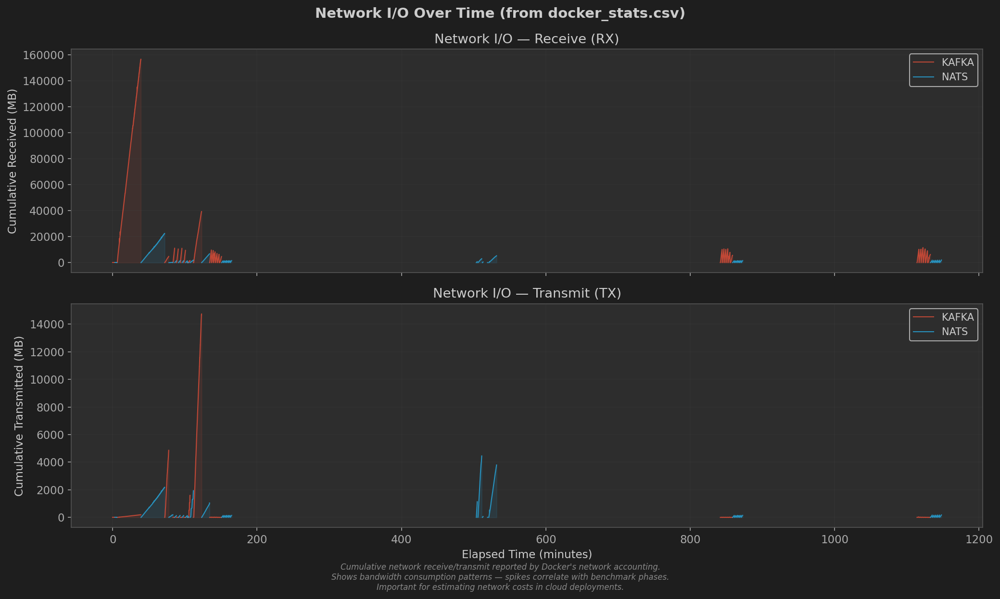

*Data source: docker_stats.csv net_io column.*

---

## 18. Memory Headroom

> **What this shows:** Peak memory usage as a percentage of the container's memory limit over time. Warning at 80%, critical at 95%. Low headroom means the broker is at risk of OOM-kill under load spikes.

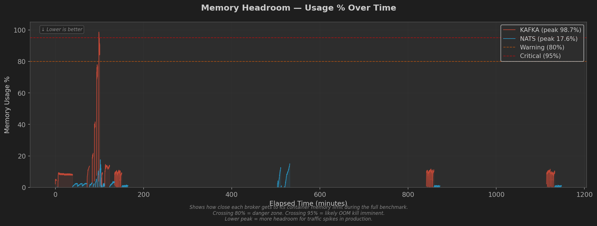

*Data source: docker_stats.csv mem_pct column. Warning threshold: 80%. Critical threshold: 95%.*

---

## 19. Scaling Efficiency — Throughput per CPU Core

> **What this measures:** Throughput normalized per CPU core at each CPU limit. Efficiency >100% means the broker gets more throughput per core when constrained (better utilization). Shows how efficiently each broker uses additional CPU resources.

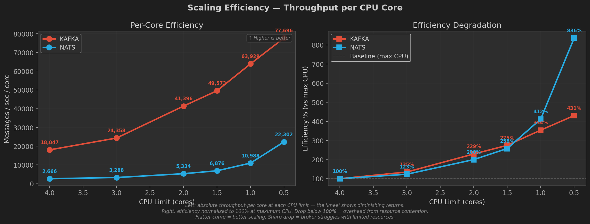

| CPU Limit | Kafka (msg/s/core) | NATS (msg/s/core) | Kafka Eff% | NATS Eff% |
|-----------|-------------------|-------------------|-----------|----------|
| 4.0 | 18,047 | 2,666 | 100% | 100% |
| 3.0 | 24,358 | 3,288 | 135% | 123% |
| 2.0 | 41,396 | 5,334 | 229% | 200% |
| 1.5 | 49,573 | 6,876 | 275% | 258% |
| 1.0 | 63,929 | 10,988 | 354% | 412% |
| 0.5 | 77,696 | 22,302 | 431% | 836% |

---

## 20. Latency Measurement Context

> **What this shows:** The conditions under which latency was measured — load percentage, target rate, number of samples, and the full percentile breakdown in microseconds. This context is critical for interpreting the latency numbers in §4.

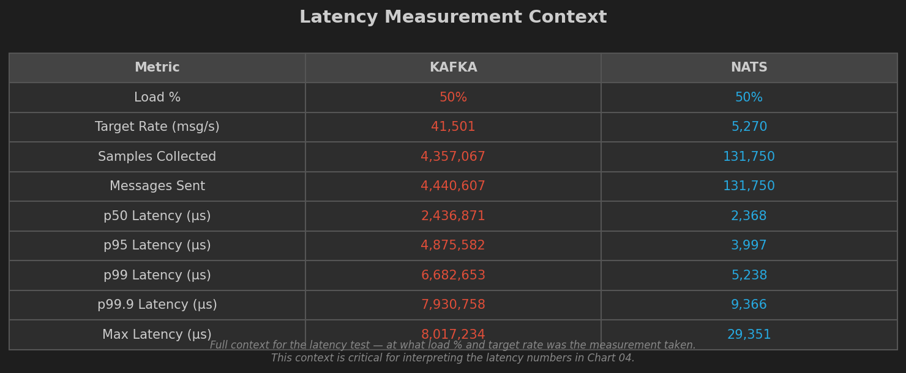

| Metric | Kafka | NATS |
|--------|-------|------|
| Load % | 50% | 50% |
| Target Rate (msg/s) | 41,501 | 5,270 |
| Samples | 4,357,067 | 131,750 |
| Messages Sent | 4,440,607 | 131,750 |
| p50 (µs) | 2,436,871 | 2,368 |
| p95 (µs) | 4,875,582 | 3,997 |
| p99 (µs) | 6,682,653 | 5,238 |
| p99.9 (µs) | 7,930,758 | 9,366 |
| Max (µs) | 8,017,234 | 29,351 |

---

## Decision

**Recommendation: MIGRATE_TO_NATS**

### Reasoning

- Kafka min viable RAM: 512m, NATS min viable RAM: 512m
- Kafka p99=6,682,653.3us, NATS p99=5,238.1us (ratio=1275.78x)
- CLI Throughput — Kafka: 37,764.4 msg/s, NATS: 48,609.0 msg/s (ratio=0.78x)
- Python Client Throughput — Kafka: 80,792.0 msg/s, NATS: 10,541.8 msg/s (reflects client library design, not broker capacity)
- Consumer Throughput — Kafka: 38,417.4 msg/s, NATS: 15,527.4 msg/s (ratio=2.47x)
- ProdCon — Kafka: P=60,227.6/C=21,610.4 msg/s, NATS: P=6,998.2/C=4,520.1 msg/s
- NATS wins latency; throughput is comparable

---

*Report generated: 2026-04-08T19:49:41-04:00*

---

*Consolidated report generated: 2026-04-08T19:49:44-04:00*
